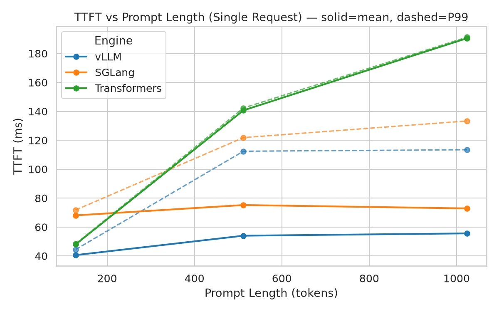
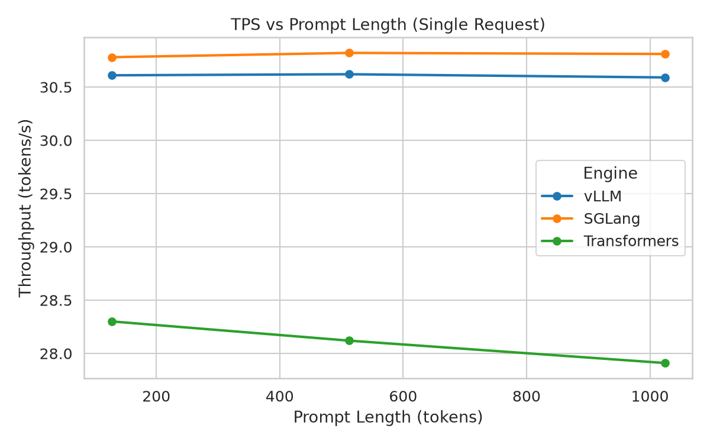
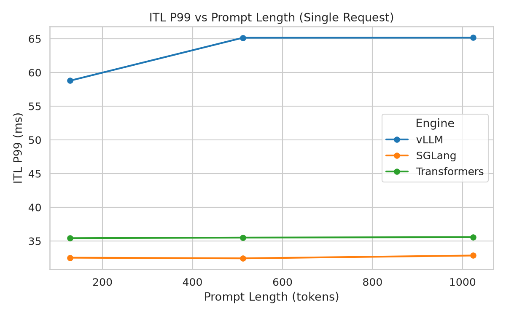
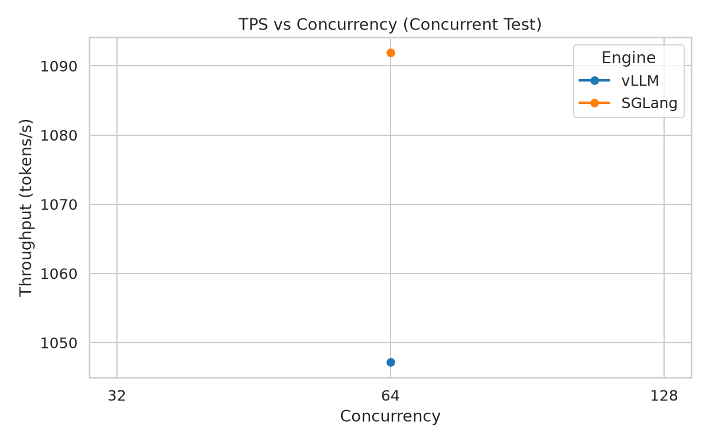
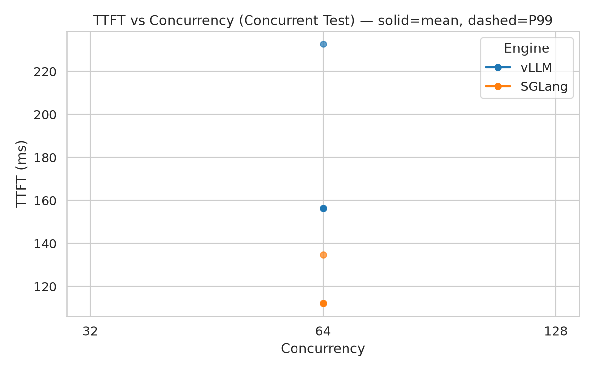
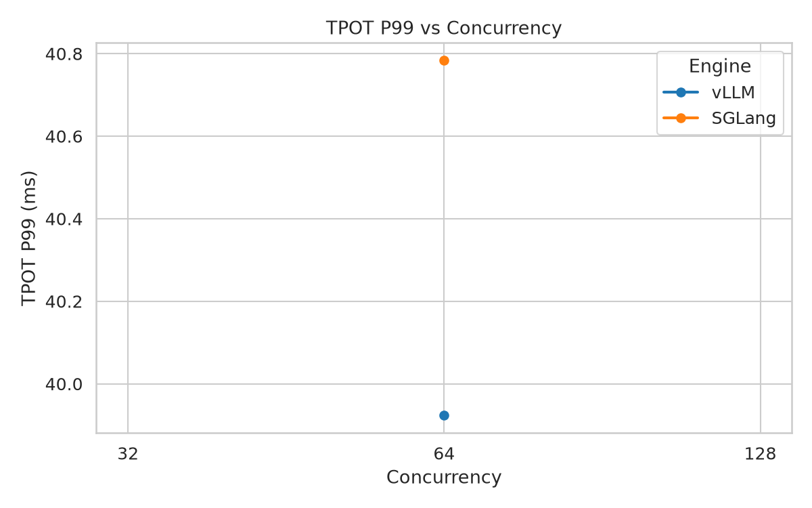
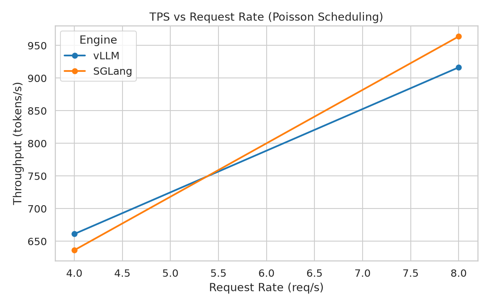
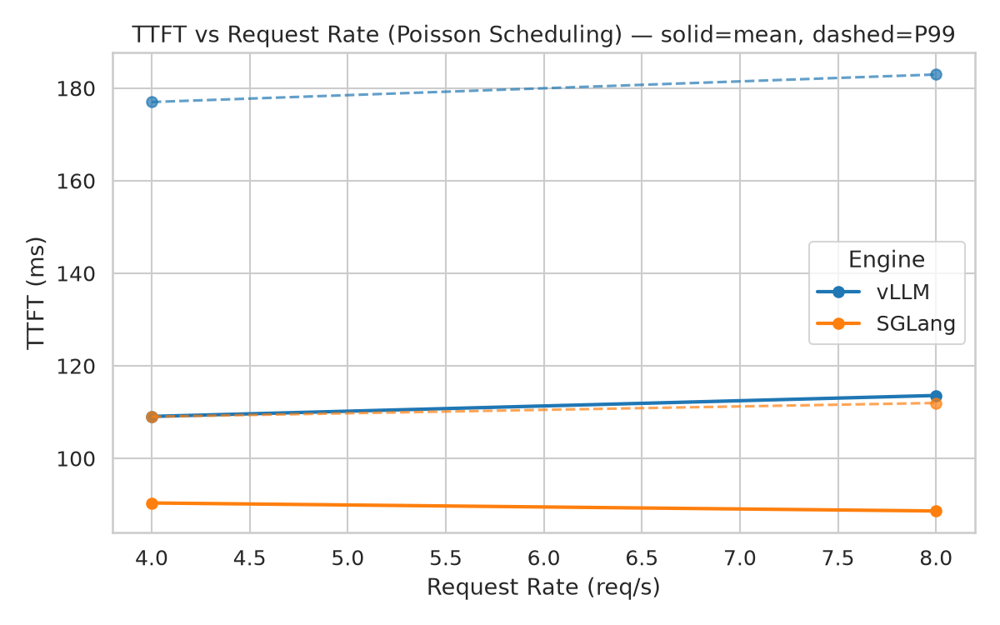
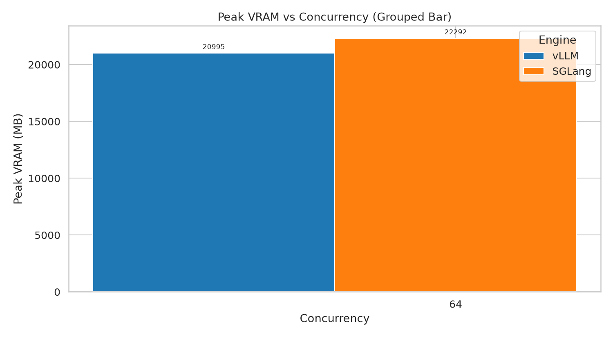
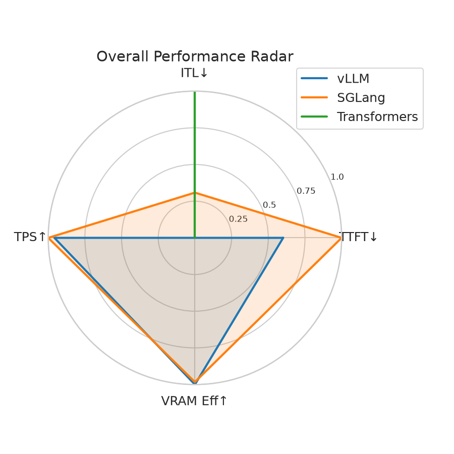

# LLM 推理引擎性能对比报告

## 测试环境

- **GPU**: (见配置)
- **模型**: (见配置)
- **引擎**: SGLang, Transformers, vLLM
- **运行 ID**: run_20260625_161746, run_20260625_170656, run_20260625_154344

## 重要说明

> **Transformers 引擎的批处理语义与 vLLM/SGLang 不同**: Transformers 使用同步批量推理（所有请求作为一个 batch 同时处理），而 vLLM/SGLang 使用连续批处理（continuous batching，请求可以动态加入/离开）。因此，并发测试中 Transformers 的 TTFT 和 TPS 指标与传统 HTTP 服务端引擎不完全可比，需结合具体部署场景理解。

## 1. 单请求延迟

| 引擎 | 输入长度 (tokens) | TTFT mean (ms) | TTFT P99 (ms) | ITL P99 (ms) | TPS (tokens/s) |
|------|-------------------|---------------|--------------|-------------|----------------|
| SGLang | 128 | 68.05 | 71.77 | 32.52 | 30.78 |
| SGLang | 512 | 75.19 | 121.83 | 32.42 | 30.82 |
| SGLang | 1024 | 72.85 | 133.32 | 32.84 | 30.81 |
| Transformers | 128 | 48.01 | 48.40 | 35.41 | 28.30 |
| Transformers | 512 | 140.66 | 142.30 | 35.50 | 28.12 |
| Transformers | 1024 | 190.54 | 191.25 | 35.57 | 27.91 |
| vLLM | 128 | 40.60 | 44.46 | 58.78 | 30.61 |
| vLLM | 512 | 54.00 | 112.41 | 65.15 | 30.62 |
| vLLM | 1024 | 55.60 | 113.43 | 65.16 | 30.59 |

### TTFT vs 输入长度

### TPS vs 输入长度

### ITL P99 vs 输入长度

## 2. 并发吞吐

| 引擎 | 请求数 | Request Rate | TTFT mean (ms) | TTFT P99 (ms) | TPS (tokens/s) | 峰值显存 (MB) |
|------|--------|--------------|---------------|--------------|----------------|---------------|
| SGLang | 64 | 4.0 | 90.35 | 108.99 | 636.32 | 22291 |
| SGLang | 64 | 8.0 | 88.62 | 111.96 | 963.82 | 22293 |
| SGLang | 64 | batch (inf) | 157.68 | 183.51 | 1675.50 | 22293 |
| vLLM | 64 | 4.0 | 109.05 | 176.99 | 661.14 | 20995 |
| vLLM | 64 | 8.0 | 113.58 | 182.94 | 916.43 | 20995 |
| vLLM | 64 | batch (inf) | 246.90 | 337.95 | 1563.88 | 20995 |

### TPS vs 并发数

### TTFT vs 并发数

### TPOT P99 vs 并发数

### TPS vs Request Rate（Poisson 调度）

### TTFT vs Request Rate（Poisson 调度）

## 3. 渐进并发扫描

*无扫描数据*

### TPS & TTFT vs 并发数（双 Y 轴）

## 4. 显存占用对比

## 5. 综合评价

### 维度说明

| 维度 | 含义 | 方向 |
|------|------|------|
| TTFT↓ | 首 Token 延迟的倒数（越低越好） | 归一化前取倒数 → 值越大越好 |
| ITL↓ | Inter-Token Latency P99 的倒数（越低越好） | 归一化前取倒数 → 值越大越好 |
| TPS↑ | 平均吞吐量 | 越高越好 |
| 显存效率↑ | TPS / 峰值显存 | 单位显存产出的吞吐，越高越好 |

三个维度均归一化到 [0, 1] 区间，其中 1 表示该维度最优，0 表示最差。雷达图面积越大，综合性能越优。
